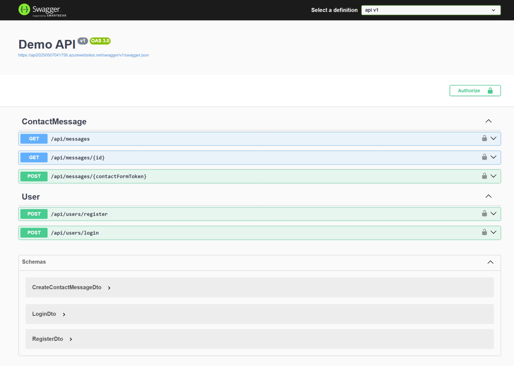

# 📨 Contact Us System


A secure and scalable **Contact Us Form API** built using **ASP.NET Core 8**, with **JWT authentication**, **SQL Server**, and **ADO.NET** for data access. This system allows users to submit contact messages and administrators to manage them securely.

## 🚀 Features

- ✅ **User Authentication & Registration**
- 🔐 **JWT Token-based Authorization**
- 📬 **Create, Read, and Delete** contact messages
- 👤 **User-specific message isolation** (users can only see their own messages)
- 🧾 **Pagination support** for retrieving messages
- 🛡️ **Input validation & SQL injection prevention**
- 💼 **Clean architecture**: DTOs, Services, Repositories, Controllers
- 🧪 **Interactive API documentation via Swagger**

## 🧱 Project Structure

```
ContactUsSystem/
├── Controllers/              # API endpoints for User and Message management
├── Models/                   # Domain models (e.g., ContactMessage)
├── DTOs/                     # Data Transfer Objects for request/response
├── Interfaces/               # Repository and Service interfaces
├── Services/                 # Business logic and token service
├── Repositories/             # ADO.NET-based data access logic
├── Helpers/                  # Utility classes (e.g., password hashing)
├── Properties/               # Launch settings
├── Program.cs                # Startup configuration
├── README.md                 # This file
└── api.csproj                # .NET project file
```

## 🌐 Live Demo

Try out the API interactively using Swagger UI:

🔗 [Swagger UI - Live Demo](https://api20250507041756.azurewebsites.net/swagger/index.html)  
🎯 Hosted on: **Microsoft Azure**

> ✅ This API is deployed and publicly accessible for testing purposes.

## 🛠️ Setup & Installation

### Prerequisites

- [.NET 8 SDK](https://dotnet.microsoft.com/download/dotnet/8.0) or later
- Microsoft SQL Server (LocalDB or Azure)
- Code editor (e.g., VS Code, Visual Studio)

### Steps

1. **Clone the repository:**

   ```bash
   git clone https://github.com/your-username/ContactUsSystem.git
   cd ContactUsSystem
   ```

2. **Update connection string:**

   Open `api/appsettings.json` and update the `DefaultConnection` under `ConnectionStrings`.

3. **Restore dependencies:**

   ```bash
   dotnet restore
   ```

4. **Run database scripts:**

   Execute `db/CreateTables.sql` to create required tables in your SQL Server instance.

5. **Run the application:**

   ```bash
   dotnet run
   ```

   The API will be available at `http://localhost:5291` (or another port depending on your setup).

## 🌐 API Endpoints

| Method   | Endpoint                           | Description                                                   |
| -------- | ---------------------------------- | ------------------------------------------------------------- |
| `POST`   | `/api/users/register`              | Register a new user                                           |
| `POST`   | `/api/users/login`                 | Log in and receive JWT token                                  |
| `POST`   | `/api/messages/{contactFormToken}` | Submit a contact message anonymously                          |
| `GET`    | `/api/messages`                    | Get all messages for the authenticated user (with pagination) |
| `GET`    | `/api/messages/{id}`               | Get a specific message by ID                                  |
| `DELETE` | `/api/messages/{id}`               | Delete a message                                              |

> ⚠️ All endpoints except registration, login, and message creation require valid JWT tokens.

### ✅ Request Examples

#### Register a New User (POST)

```http
POST /api/users/register
Content-Type: application/json

{
  "firstName": "John",
  "lastName": "Doe",
  "username": "johndoe",
  "email": "john@example.com",
  "password": "Password123"
}
```

#### Login (POST)

```http
POST /api/users/login
Content-Type: application/json

{
  "username": "johndoe",
  "password": "Password123"
}
```

#### Submit Contact Message (POST)

```http
POST /api/messages/{{contactFormToken}}
Content-Type: application/json

{
  "name": "Jane Smith",
  "email": "jane.smith@example.com",
  "message": "I need help with my order."
}
```

#### Get Messages (GET)

```http
GET /api/messages?pageNumber=1&pageSize=5
Authorization: Bearer {{token}}
```

## 📦 DTO Overview

| DTO Class                  | Purpose                             |
| -------------------------- | ----------------------------------- |
| `RegisterDto`              | For user registration input         |
| `LoginDto`                 | For user login input                |
| `UserDto`                  | For returning user details          |
| `CreateContactMessageDto`  | For submitting new contact messages |
| `ContactMessageDto`        | Summary of contact messages         |
| `DetailsContactMessageDto` | Detailed view of a single message   |

## 🔐 Authentication

- Uses **JWT tokens** for stateless authentication.
- Tokens are generated upon successful login.
- Users must include the token in the `Authorization` header for protected endpoints.

## 🗂️ Database Schema

The system uses two main tables:

- `Users`: Stores registered users with hashed passwords and unique contact form tokens.
- `ContactMessages`: Stores messages submitted through the form, linked to users via foreign key.

Refer to:

- `db/CreateTables.sql` - Table creation script
- `db/DropTables.sql` - Cleanup script
- `db/docs/ERD.png` - Entity Relationship Diagram

## 📖 API Documentation

- 🐳 **Swagger UI**:
  Access the interactive API docs at:
  [http://localhost:5291/swagger](http://localhost:5291/swagger)

- 📬 **Postman Collection**:
  Import our Postman collection to quickly test the API:
  👉 [Download Postman Collection](docs/ContactUsAPI.postman_collection.json)



## ⚙️ Technologies Used

- **ASP.NET Core 8**
- **C#**
- **ADO.NET** (no ORM used)
- **Microsoft SQL Server**
- **JWT Authentication**
- **Swagger / Swashbuckle**
- **Postman**
- **Git + GitHub**

> 🛠️ _Built with ❤️ using ASP.NET Core and ADO.NET._
